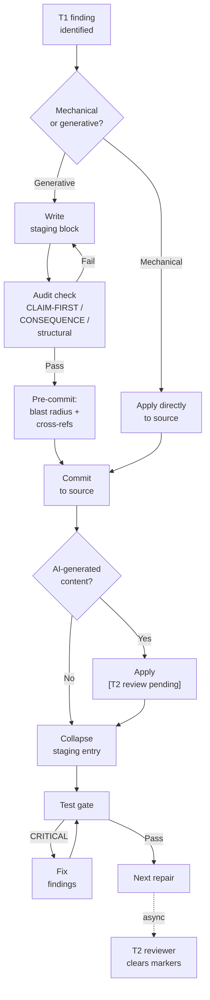

# Repair Staging Guide — Argument Structure Audit

*Companion to [t1_strip.md](t1_strip.md) and [specification.md](specification.md). Governs how generative repairs are staged and audited before being committed to the source document.*

---

## Purpose

Some T1 repairs are mechanical relabeling — change a label, convert a flat paragraph to a list item. These can be applied directly to the source document; the change is syntactic and reversible on inspection.

Other repairs are generative — rewriting a lead sentence (CLAIM-FIRST), constructing a consequence sentence (CONSEQUENCE), or reordering argument structure. For these, writing directly to the source document before auditing the candidate creates two risks:

1. The source document is in a half-repaired state if the candidate fails
2. The repair is applied and the audit check is skipped or assumed

The staging workflow isolates generative repairs: the candidate is written to a staging area within the audit file, audited there, and only committed to the source document after the check passes.

---

## When to Stage

| Repair type | Stage required? |
| :--- | :--- |
| Relabeling — `*Old label:*` → `*Scope (topic):*` | No — syntactic, directly verifiable |
| Flat-paragraph → `-` list item conversion | No — syntactic |
| CLAIM-FIRST — sentence reorder (existing sentence moved to front) | Yes — verify the moved sentence is standalone before committing |
| CLAIM-FIRST — new lead sentence written | Yes — verify standalone claim; flag for T2 review |
| CONSEQUENCE — new sentence written | Yes — verify valid form (a–d); flag for T2 review |
| CONSEQUENCE — existing sentence moved to final position | Yes — verify consequence form holds in isolation |
| Structural nesting (e.g. demoting a sibling to sub-argument) | Yes — verify the parent claim count and CLAIM-FIRST of the nested item |

**Rule of thumb:** if the repair generates or reorders prose, stage it. If it only changes markup or label text, apply directly.

---

## Workflow

```
Stage → Audit in staging → Commit to source → Collapse staging entry
```

### Step 1 — Open staging section

In the audit file, add a `## Staging` section below the Summary verdict if one does not exist.

### Step 2 — Write the staging block

For each repair candidate, write a block with this structure:

```markdown
### Repair candidate — [§N] `*[Type] ([Topic]):*`

**Finding:** [one-sentence statement of the finding being repaired]

**Candidate:**
> "[the candidate sentence or reordered block]"

**[Check name] audit:** [is the pass condition met? state the specific test applied and the result — Pass or Fail]

**New problem introduced?** [Does the candidate create a sequencing dependency, orphan a cross-reference, or require a corresponding edit at another location? State yes/no and where.]

**Remainder:** [one sentence describing what happens to displaced or absorbed content]

**Commit decision:** [✓ proceed / ✗ revise — reason]
```

### Step 3 — Apply the audit check to the candidate

Do not assume the candidate passes. Apply the check's pass condition explicitly:

- **CLAIM-FIRST:** can the receiver hold the candidate sentence without reading further and be correctly oriented? State yes or no and why.
- **CONSEQUENCE:** does the candidate satisfy one of forms (a–d)? Name the form.
- **Structural repair:** does the parent claim count still hold? Does the nested item's CLAIM-FIRST pass?

If the candidate fails: revise it in the staging block. Do not move to Step 4 until the check passes.

### Step 4 — Commit to source document

Before applying: (1) grep the changed symbol, label, or term across the project — identify every location requiring a corresponding edit; apply them in the same commit or record them explicitly as follow-on repairs; (2) verify that every cross-reference added by the candidate (`*[→ X]*`) is defined in the source at the point of commit.

Apply the repair to the source document. The staging block confirms what was changed and why.

### Step 5 — Collapse the staging entry

Replace the full staging block with a one-line note:

```markdown
*`*[Type] ([Topic]):*` — staged, [check] ✓, committed: [one-phrase description of the change].*
```

The collapsed note is the audit record of the repair. The full staging block is discarded — it was a workspace, not a permanent record.

If the project has a document quality suite, run it after collapsing and fix all CRITICAL findings before proceeding to the next repair.

---

## Staging Block Format — Quick Reference

```markdown
### Repair candidate — [§N] `*[Type] ([Topic]):*`

**Finding:** [finding]

**Candidate:**
> "[candidate text]"

**[Check] audit:** [test applied] → [Pass / Fail]

**New problem introduced?** [yes/no — if yes, state what and where]

**Remainder:** [displaced content handling]

**Commit decision:** [✓ proceed / ✗ revise]
```

**Collapsed form (post-commit):**

```markdown
*`*[Type] ([Topic]):*` — staged, [check] ✓, committed: [description].*
```

---

## Integration with the T1 Strip

The T1 execution strip already flags AI-generated repairs as T2-review candidates (using the `*[T2 review pending]*` marker). The staging guide does not replace that flag — it adds a pre-commit check layer before the flag is applied.



For mechanical sentence-order repairs (existing sentence moved, no new content generated), the `*[T2 review pending]*` flag may be omitted if the moved sentence's content is unchanged — the staging audit confirms the sentence passes the check; no domain judgment is introduced. State this explicitly in the collapsed entry.

---

## Example

**Repair:** `*Argument (cost implications):*` §3 — CLAIM-FIRST failure; lead described the mechanism, conclusion at sentence 4.

**Staged candidate:**
> "Adopting this approach increases per-unit cost by 15–20% in the first year — a constraint that rules out budget-neutral rollout scenarios."

**CLAIM-FIRST audit:** states the effect and its consequence. Receiver can hold without reading further. ✓ Pass.

**Remainder:** mechanism sentences follow as premises; original sentence 4 absorbed into new lead.

**Collapsed entry:** *`*Argument (cost implications):*` — staged, CLAIM-FIRST ✓, committed: new lead states conclusion first; mechanism sentences follow as support.*
