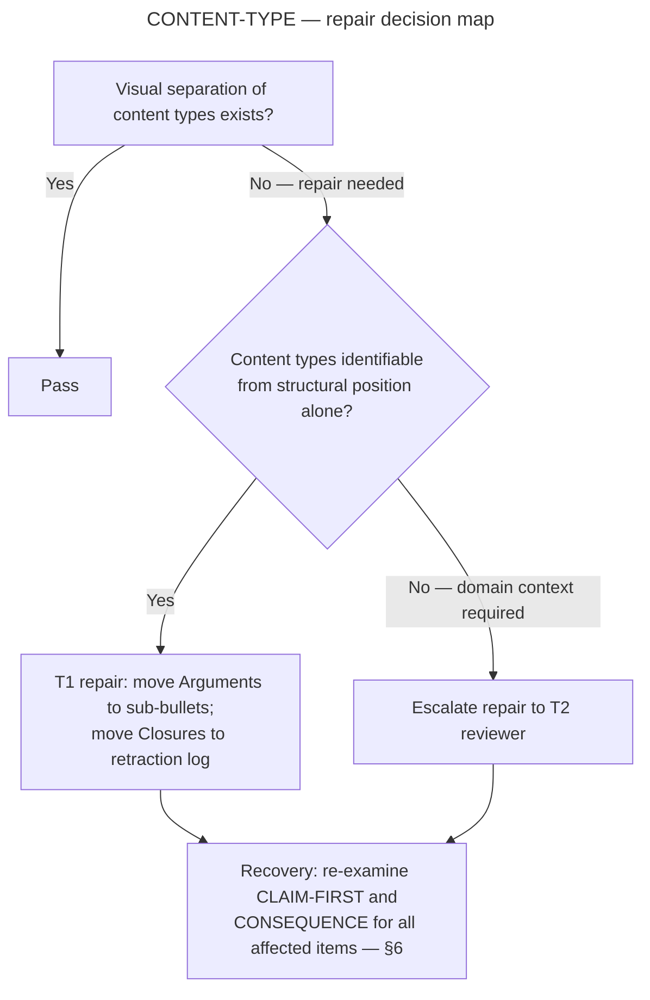
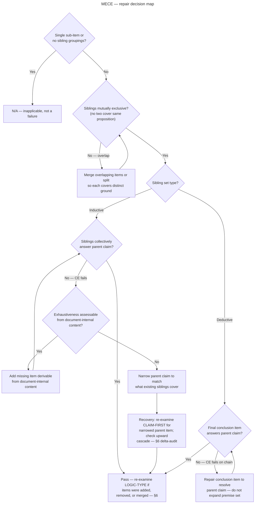
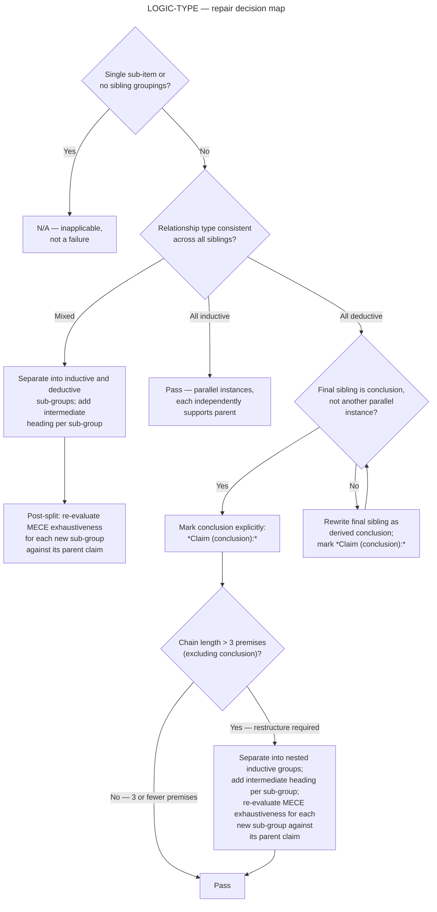
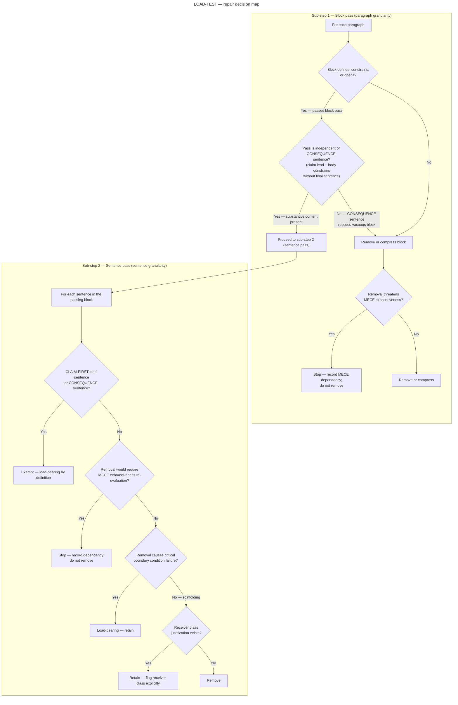
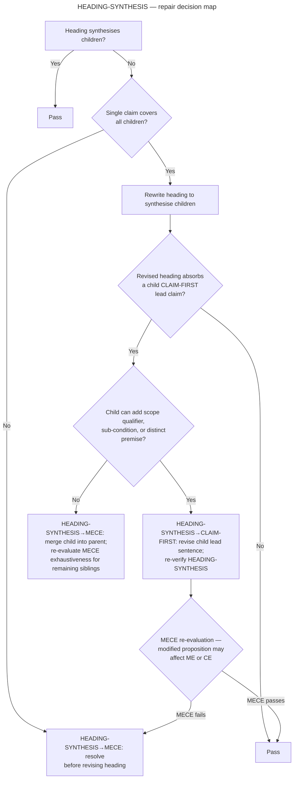
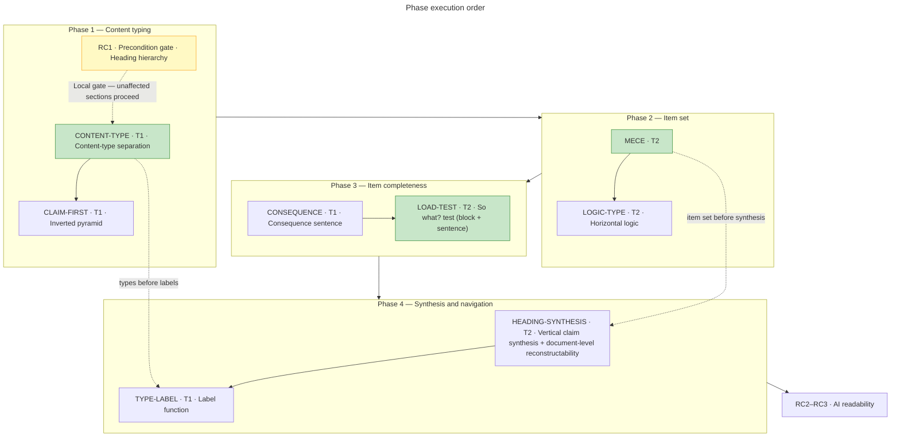

# Argument Structure Audit Specification — Structural Navigability and Compliance Self-Check

*v2.0 · Retraction log: [retraction_log.md](retraction_log.md)*

**Document role:** Canonical specification. Defines all check pass conditions, decision logic, scope-out rules, and recovery edges authoritatively.

**AI usage modes:**
- *Execution (T1 checks only):* use `t1_strip.md` — the T1 execution strip. Do not execute this document directly; competing instruction layers produce unreliable results.
- *Reading — explanation, proposal, reference:* this document may be given to an AI in read-only mode. Ask it to explain checks, propose audit strategies, or summarise scope-out rules. Comprehension tasks do not carry the same execution load.
- *T2 checks (`MECE`, `LOGIC-TYPE`, `LOAD-TEST`, `HEADING-SYNTHESIS`):* require a human domain-expert auditor. AI may not apply these checks reliably.

Use this document to audit whether a structured argument document satisfies its compliance target in its own encoding, and whether a blank-AI receiver can navigate it without full linear parsing.

---

*Human+AI workflow:*

| Step | Who | Document | Action |
| :--- | :--- | :--- | :--- |
| 1. Scope | Human | This spec — §0 | Fill in the §0 parameter table. Identify consequence unit, compliance target, numbered item convention. Copy values into the T1 strip's §0. |
| 2. Document class | Human | This spec — scope-out table | Determine document class. Note which checks to suspend. Record in T1 strip §0 section-level overrides. |
| 3. T1 execution | AI | T1 strip (pre-filled §0) | Run RC1 → CONTENT-TYPE → CLAIM-FIRST → CONSEQUENCE → TYPE-LABEL → RC2 → RC3. Return findings list. Escalated items are marked pending T2 review. |
| 4. T2 + escalations | Human | This spec — §5 T2 checks, §5.1 maps, §6 recovery table | Resolve AI-escalated items with domain knowledge. Execute MECE, LOGIC-TYPE, LOAD-TEST, HEADING-SYNTHESIS. Apply full recovery edge table after any T2 repair. |

*The handoff point is §0: the human fills it using this spec; the AI receives the T1 strip with §0 pre-filled.*

*Scope (encoding tokens):*

| Token | Meaning |
| :--- | :--- |
| `` `CHECK-NAME` `` | Check identifier — maps to a §5 check section (`###`) |
| `[value — from §0]` | Fill-in parameter — resolve from §0 parameter table before applying |
| `*Type (Topic):*` | Content-type label — see §3 for taxonomy |
| `· T1` / `· T2` | Receiver tier — T2 requires a domain-expert human auditor |

---

## Table of Contents

| § | Section | Function |
| --- | :--- | :--- |
| §0 | Parameterisation | Bind document-specific values before applying any check |
| §1 | The Core Failure Mode | Define the failure pattern this audit targets |
| §2 | Progressive Disclosure Levels | State the L0–L4 intelligibility standard |
| §3 | Content-Type Taxonomy | Define Claim / Scope / Argument / Closure and their label forms |
| §4 | The Three Structural Techniques | Inverted pyramid, consequence sentence, label function — with authoring pipeline |
| ↳ §4.1 | Inverted Pyramid | Per-block claim-first technique — test and failure patterns |
| ↳ §4.2 | Consequence Sentence | Per-sub-item consequence technique — test and failure patterns |
| ↳ §4.3 | Content-Type Labels | Per-sub-item label technique — test and failure patterns |
| ↳ §4.4 | Authoring Pipeline | Minto baseline to compliance-target sequence — four augmentation steps |
| §5 | Structural Audit Checklist | Nine structural checks and three readability checks; pass conditions and repair actions |
| ↳ `CONTENT-TYPE` · T1 | Content-type separation | Arguments and Closures visually distinct from Claims and Scope |
| ↳ `CLAIM-FIRST` · T1 | Inverted pyramid | First sentence of every definition item is a standalone claim |
| ↳ `MECE` · T2 | Mutual exclusivity and collective exhaustiveness | Sibling items cover distinct ground and collectively answer the parent claim |
| ↳ `LOGIC-TYPE` · T2 | Horizontal logic | Relationship type within each sibling group is consistent and explicit |
| ↳ `CONSEQUENCE` · T1 | Consequence sentence | Last sentence of every sub-item states a consequence unit |
| ↳ `LOAD-TEST` · T2 | "So what?" test | Two-level test: block pass (paragraph), then sentence pass |
| ↳ `HEADING-SYNTHESIS` · T2 | Vertical claim synthesis | Each heading synthesises its children; document reconstructable from headings alone |
| ↳ `TYPE-LABEL` · T1 | Label function | Every sub-item label identifies content type using `*[Type] ([Topic]):*` format |
| ↳ §5.1 | Decision Maps | Five flowcharts encoding branching repair logic for `CONTENT-TYPE`, `MECE`, `LOGIC-TYPE`, `LOAD-TEST`, `HEADING-SYNTHESIS` |
| §6 | Application Priority | Four-phase application order, `RC1` precondition gate, hard constraints, recovery edges |
| ↳ Phase 1 | Content typing | `RC1` gate → `CONTENT-TYPE` → `CLAIM-FIRST` |
| ↳ Phase 2 | Item set | `MECE` → `LOGIC-TYPE` |
| ↳ Phase 3 | Item completeness | `CONSEQUENCE` → `LOAD-TEST` |
| ↳ Phase 4 | Synthesis and navigation | `HEADING-SYNTHESIS` → `TYPE-LABEL` |
| §7 | Self-Compliance Check | This specification's own audit results |
| §8 | Encoding Checks for AI Receivers | `RC2`–`RC3` encoding checks |
| ↳ Side benefit | Graphability | A compliant document can be parsed into a typed DAG without NLP |

---

## §0 — Parameterisation

*Scope (what this template audits):* This template audits the **argument structure** of a document — not its formatting, prose quality, or domain correctness. It operationalizes the Minto Pyramid Principle (MECE, horizontal logic, inverted pyramid) and extends it with content-type taxonomy (Claim/Scope/Argument/Closure) and AI readability checks. The R-series and `TYPE-LABEL` are the only purely syntactic checks; every other check tests whether the document's argument is correctly structured.

*Structural prerequisite:* The audit is diagnostically useful only for documents with at least two levels of explicit argument hierarchy — a parent claim with named sibling sub-items at L2 or below. Flat prose documents satisfy most structural checks trivially via N/A and produce no actionable findings; do not apply this template to documents without hierarchy.

*Scope (document classes that produce false findings):* the following classes produce systematic false findings — not N/A designations — because their argument structure is incompatible with the Minto model by design. Do not apply this template to these classes without first redefining the compliance target and suspending the affected checks.

| Document class | Checks that produce false findings | Reason |
| :--- | :--- | :--- |
| Mathematical proofs | `CLAIM-FIRST`, `CONSEQUENCE`, `HEADING-SYNTHESIS`, `LOGIC-TYPE` | Proofs build toward the theorem by construction — premises necessarily precede the conclusion. `CLAIM-FIRST` flags every premise as a violation; `CONSEQUENCE` flags intermediate premises that legitimately lack standalone consequence units (the consequence is the theorem, available only at proof completion, not at each premise step); `HEADING-SYNTHESIS` flags stage headings (*Lemma*, *Corollary*) that cannot synthesise because the claim does not yet exist at that point in the argument. `LOGIC-TYPE` deductive repair requires marking the conclusion item with `*Claim (conclusion):*`; mathematical proofs use formal notation conventions (*Theorem*, *QED*, *Corollary*) that are structurally equivalent but incompatible in form — applying the label requirement would violate the proof's notation convention by design. |
| Dialectical arguments — documents that weigh competing hypotheses before concluding | `CLAIM-FIRST`, `CONSEQUENCE`, `HEADING-SYNTHESIS`, `MECE` | The claim is structurally deferred until after the weighing. Lead sentences are legitimately conditional or comparative, not standalone claims. `CONSEQUENCE` flags hypotheses under evaluation — a consequence sentence would require committing to a conclusion before the weighing is done, which is structurally unavailable. `MECE` CE fails by design: exhaustiveness is resolved by the conclusion, not by the hypothesis set. |
| Abductive reasoning — troubleshooting guides, incident reports | `CLAIM-FIRST`, `CONSEQUENCE`, `MECE`, `HEADING-SYNTHESIS` | The lead claim is necessarily tentative and qualified by incomplete evidence — `CLAIM-FIRST` and `CONSEQUENCE` require definitive boundary statements that are structurally unavailable until diagnosis is complete. `MECE` CE fails because best-fit abductive inference operates over a non-exhaustive candidate set; the sibling set is not designed to collectively exhaust the problem space but to contain the most plausible explanations given current evidence. `HEADING-SYNTHESIS` fails because troubleshooting headings legitimately name diagnostic stages or functional areas ("Initial Diagnosis", "Root Cause Analysis") rather than synthesising claims — the heading identifies the section's role in the diagnostic process, not a conclusion from its children. |

*T2 scope implication:* T2 checks (`MECE`, `LOGIC-TYPE`, `LOAD-TEST`, `HEADING-SYNTHESIS`) are the structural core of the audit — they test MECE completeness, logical relationship type, block and sentence load, and vertical synthesis with document-level reconstructability. Selecting T1-only scopes out this core and limits the audit to syntactic and label compliance only. T2 requires a human auditor with domain knowledge of the document under audit.

Fill in these values before applying this template to a new document.

*Scope (audit parameters):*

| Parameter | Value for this audit |
| :--- | :--- |
| **Document under audit** | `[filename]` |
| **Compliance target** | `[e.g. a named standard, an internal style guide, a regulatory requirement]` |
| **Compliance target definition** | `[one-sentence statement of what the target requires]` |
| **Failure name for this document class** | `[e.g. hierarchy collapse, argument burial, claim ambiguity]` |
| **L0 content** | `[what a reader must be able to extract at a glance — e.g. document name + N top-level claims]` |
| **L1 content** | `[one level below L0 — e.g. one-sentence statement per claim]` |
| **Consequence unit** | `[what a "consequence" means for this document class — e.g. protocol instruction, design constraint, rule application]` |
| **Document-level convention for numbered items** | `[e.g. numbered bold items are Claims; numbered items are steps; state explicitly or mark N/A]` |
| **Audit tier in scope** | `[Tier 1 only / Tier 1 + Tier 2]` — Tier 2 checks (`MECE`, `LOAD-TEST`, `HEADING-SYNTHESIS`) require a domain-expert human auditor with subject-matter knowledge of the document. Blank-AI application of Tier 2 checks produces inconsistent results and should not be treated as authoritative. State auditor name or role if Tier 2 is in scope. |
| **Section-level document class overrides** | `[Optional. For hybrid documents only: list sections where a different N/A rule applies, e.g. "§2: procedural — MECE N/A; §4: argumentative — full T2 checks." If the document is uniform, write N/A.]` |

*Scope (compliance target and checks):* The checks do not individually test compliance — they collectively operationalize it. Identify which checks directly serve the compliance target and which serve navigability. Typical mapping: `LOAD-TEST` (block pass) is the direct operationalization at block level (does this block encode a boundary condition?); `LOAD-TEST` (sentence pass) operationalizes minimality (is this sentence necessary?); `CONTENT-TYPE` operationalizes the structural distinction between boundary conditions and content; `MECE` operationalizes minimality and sufficiency at grouping level (ME = no redundancy; CE = no missing boundary condition). State this mapping explicitly for the document class under audit — a check that does not serve the compliance target is navigability infrastructure, not a compliance check.

---

## §1 — The Core Failure Mode

*This section is rationale only — it defines the failure pattern the audit targets. No executable check procedures are in this section; normative checks are in §5.*

A document that defines [compliance target — from §0] as a constraint must satisfy it in its own encoding. Failure in a document is not word count — it is **[failure name — from §0]**: when all prose is at the same structural weight, the receiver has no anchor points from which to expand or skip. The document transmits content (Arguments, justifications, audit-closures) where it should transmit boundary conditions (Claims, definitions, Scope).

**The "So what?" test** — apply to every paragraph and sub-item: does the block reduce the reader's information search space? A block that does not define, constrain, conclude, or point passes no information.

*Scope (LOAD-TEST block pass criteria):*

| Outcome | Search space effect |
| :--- | :--- |
| Defines a term | Reduces ambiguity — receiver knows what $X$ means |
| States a constraint | Reduces design space — receiver knows what is ruled out |
| Names an open question | Reveals unknown space — receiver knows where the boundary is |

A block that does none of these is "so what?" content. It is description without consequence.

---

## §2 — Progressive Disclosure Levels

*This section is rationale only — it defines the intelligibility standard that the structural checks operationalize. No executable check procedures are in this section; normative checks are in §5.*

Progressive disclosure requires each level to be independently intelligible — a reader at level $N$ can decide whether to enter level $N+1$ without having already read it. A document fails progressive disclosure when the gap between two adjacent levels is too large to jump without full linear parsing.

*Scope (progressive disclosure levels):*

| Level | Content | Independently intelligible? |
| :--- | :--- | :--- |
| **L0** | [L0 content — from §0] | Yes — must be readable in isolation |
| **L1** | [L1 content — from §0] | Yes — must be readable in isolation |
| **L2** | Section sub-heads: must name function, not topic | Must be visible by scanning bold labels |
| **L3** | Definition items (numbered) + named sub-paragraphs | Must have lead claim as first sentence |
| **L4** | Sub-bullets with type labels | Must be skippable from label alone |

**Failure condition:** if a blank AI must read L2 in full to discover that L3 exists, L3 is invisible. Each level must be reachable from the level above without entering the level below.

---

## §3 — Content-Type Taxonomy

*This section is rationale only — it defines the four content types referenced by `CONTENT-TYPE` and `TYPE-LABEL` checks. No executable check procedures are in this section; normative checks are in §5.*

Every block of prose in a structured argument document carries one of four content types. These types must be visibly distinguishable — a reader should be able to identify the type from the label or lead sentence without reading the full block.

*Scope (content-type taxonomy):*

| Type | Function | Reader action | Label form |
| :--- | :--- | :--- | :--- |
| **Claim** | States what must hold — the boundary condition | Read fully on first pass | Bold heading or numbered item lead |
| **Scope** | States what the claim does or does not reach — includes examples, analogies used as structural illustrations, and application instantiations that bound the claim's range | Read if operating at a boundary | *Italicised sub-label:* e.g., *Scope (quantifier range)*, *Scope (example — [topic])*, *Scope (analogy — [topic])* |
| **Argument** | Justifies why the claim holds | Skip if claim is accepted; read if challenged | *Italicised sub-label:* e.g., *Argument (why X)* |
| **Closure** | Records why an attack or alternative was rejected | Skip unless auditing the retraction log | *Italicised sub-label + §Cxx reference* |

*Scope (Consequence is not a content type):* The `CONSEQUENCE` check (§4.2, §5) names a structural position requirement — the last sentence of each sub-item. "Consequence" is not a fifth content type and `*Consequence:*` is not a valid `TYPE-LABEL` label. Section-level cross-sibling synthesis — a standalone item collecting the payoff of an entire sibling set — should use `- *Scope (consequence — [topic]):*`: Scope covers what the claim's sibling set collectively establishes as a result. Do not infer a fifth type from the `CONSEQUENCE` check name.

**Failure condition:** when Claim and Argument are at the same visual weight, a reader cannot triage. They must read the full block to determine whether it adds a new constraint or merely justifies an existing one.

*Argument (AI receiver readability):* For human readers, bold and italic create visual salience through pixel contrast — a pre-attentive signal. For AI receivers processing raw token sequences, `**bold**` and `*italic*` are character patterns whose semantic weight depends on training-data correlations, not rendering. What is rendering-independent and therefore reliable for both human and AI receivers: explicit type labels (`*Claim (...):*`, `*Scope (...):*`) encode content type in text — recoverable from raw tokens without a renderer. This is the load-bearing justification for the `TYPE-LABEL` label requirement: bold/italic signal salience; labels signal type. The three rendering-independent structural signals in order of reliability: (1) heading level (`##`, `###`) — structural hierarchy; (2) explicit type label (`*[Type] ([Topic]):*`) — content type; (3) list indentation — nesting depth. Bold and italic are supplementary, not structural.

---

## §4 — The Three Structural Techniques

*This section is rationale only. The "Test" paragraphs in §4.1–§4.3 illustrate how to recognise violations — they are not executable check procedures. Normative pass conditions, escalation paths, and repair actions are in §5.*

### §4.1 — Inverted Pyramid — apply per block

Each block delivers its most important claim first, then grounds it, then scopes it. The reader gets a complete (if compressed) claim from the first sentence and can stop there if that level is sufficient.

**Test:** Read only the first sentence of each Definition item and named sub-paragraph. Does that sentence stand alone as a transmissible Claim — a sentence a receiver could hold without reading further and be correctly oriented? If the first sentence is a specification, a condition, or a qualification rather than a Claim, the block fails the inverted pyramid test.

**Failure pattern to detect:**
- Starts with "Under this framing..." → mid-argument, not a claim
- Starts with "Whether this is the case..." → open question buried in prose
- Starts with "For all [variable]..." → specification before claim

**Corrected pattern:** State the consequence first, then the specification. The first sentence must be a Claim the receiver can hold.

*Argument (named tradition):* The inverted pyramid is the single-level form of the **Minto Pyramid Principle** (Barbara Minto, 1987): claim → support → scope, applied recursively from document to section to paragraph to sentence. The "So what?" test in §1 and the consequence sentence in §4.2 are the same check at different levels — §1 applies it to paragraphs, §4.2 applies it to sub-items.

### §4.2 — Consequence Sentence — apply at the end of each sub-item

Each sub-item should close with one sentence stating what the constraint rules out, or what it permits that might otherwise be questioned. This is the information-space reduction payoff.

**Test:** Read only the last sentence of each sub-item. Does it state a [consequence unit — from §0]? If the last sentence is another scope qualification or a pointer without a conclusion, the sub-item fails the consequence test.

**Failure pattern to detect:**
- Ends with "...is not yet formally characterised." → names an open question but draws no consequence
- Ends with "...is covered elsewhere." → pointer without a receiver instruction
- Ends with "...as established above." → backward reference without a forward consequence

**Corrected pattern:** End with what the receiver should conclude or do.

*Scope (embedding rule):* The consequence sentence is embedded within each sub-item as its final sentence — it is not factored out as a standalone labeled item after the sibling set. A standalone `*Consequence:*` item placed after all siblings is a `TYPE-LABEL` failure: "Consequence" is a check name, not a content type (see §3). If a section-level synthesis item is needed — collecting the cross-sibling payoff in a single labeled item — use `- *Scope (consequence — [topic]):*`.

### §4.3 — Content-Type Labels — apply at the start of each sub-item

Each sub-item label must convey the function of the item, not just its topic. A label is load-bearing if a receiver can decide to skip the item based on the label alone. A label is decorative if the receiver must read the item to know whether it is relevant.

**Test — label function test:** Cover the body of each sub-item and read only its label. Can you determine: (a) whether this item is a Claim, Scope, Argument, or Closure? (b) whether it is relevant to your current question? If neither is answerable from the label, the label is decorative.

**Failure pattern to detect:**
- [✗] A topic label that names a subject but not a function (e.g. *Typed DAG*)
- [✗] A pseudo-functional label that names a presentation modality or check concept rather than a taxonomy type (e.g. *Example:*, *Biological model:*, *Analogy:*, *Consequence:*) — these classify what kind of content the item contains, but the lead word is not Claim, Scope, Argument, or Closure
- [✓] A label that names function (e.g. *Scope (quantifier range, §C1)*)

**Corrected pattern:** Label format is `*[ContentType] ([Topic]):*`
- *Scope (quantifier range, §C1)*
- *Claim (typed DAG requirement)*
- *Argument (why truth-table equivalence is sufficient)*

### §4.4 — Authoring Pipeline — from Minto to [compliance-target]-compliant

For documents authored from scratch, Minto compliance provides the baseline. The delta to [compliance target — from §0] is three targeted augmentations applied in this order.

*Argument (augmentation sequence beyond Minto):*

| Step | Check | What it adds beyond Minto |
| --- | :--- | :--- |
| 1 | `CLAIM-FIRST`, `MECE`, `LOGIC-TYPE` — Inverted pyramid, MECE, Horizontal logic | Minto baseline. A document written from Minto already satisfies all three — verify before applying the augmentations below. If any of these fail, fix Minto compliance first. |
| 2 | `CONTENT-TYPE` — Content-type separation | Separates Argument and Closure blocks from Claim blocks at the same visual weight. Minto does not distinguish these — it treats all support nodes as equivalent. |
| 3 | `TYPE-LABEL` — Label function | Adds content-type labels to sub-items: *Claim*, *Scope*, *Argument*, *Closure*. Minto produces topology; `TYPE-LABEL` adds the typed structure layer. |
| 4 | `CONSEQUENCE` — Consequence sentence | Closes each sub-item with an explicit statement of what is now ruled out or permitted. Minto's "So what?" test checks that the entailment direction holds; `CONSEQUENCE` makes it explicit in prose. |

**Result:** A document that passes steps 1–4 encodes a recoverable argument structure. `LOAD-TEST` and `HEADING-SYNTHESIS` address navigability — they do not add to compliance but reduce reconstruction effort.

*Scope (pipeline applicability):* [State any conditions under which full compliance is not achievable by formatting alone — e.g. non-monotonic reasoning, incomplete axiomatisation, or argument types outside the taxonomy. If none apply, write N/A.]

---

## §5 — Structural Audit Checklist

Apply in the phase order defined in §6. The summary table below provides orientation; full pass conditions, scope notes, N/A guards, and repair actions are in the per-check `###` sections that follow.

**Tier classification:** Checks are divided into two tiers based on the receiver required to apply them reliably.

*Scope (receiver tiers):*

| Tier | Checks | Receiver | Basis |
| :--- | :--- | :--- | :--- |
| **T1 — Blank-AI applicable** | `CONTENT-TYPE`, `CLAIM-FIRST`, `CONSEQUENCE`, `TYPE-LABEL` | Blank-AI or any auditor | `CONTENT-TYPE` and `TYPE-LABEL`: pass conditions are syntactic and binary; repairs are bounded and mechanical. `CLAIM-FIRST` and `CONSEQUENCE`: detection of structural position is T1-executable (lead sentence and final sentence are mechanically locatable); pass-condition evaluation has an escalation path — when determining whether a sentence constitutes a standalone claim or a valid consequence form requires semantic judgment not resolvable from structure alone, escalate to T2. See §5 escalation clauses for each check. |
| **T2 — Domain-expert required** | `MECE`, `LOGIC-TYPE`, `LOAD-TEST`, `HEADING-SYNTHESIS` | Human auditor with domain knowledge | Pass conditions require semantic judgment (exhaustiveness, inductive vs. deductive relationship type, constraint vs. description, synthesis quality, and argument reconstructability); repairs are generative or unbounded. Blank-AI application produces inconsistent results and must not be treated as authoritative. |

If audit tier in scope (§0) is set to Tier 1 only, skip all T2 checks. Tier 2 results recorded without a named domain-expert auditor are invalid.

*Scope (check summary):*

| Check | Tier | Summary |
| :--- | :--- | :--- |
| `CONTENT-TYPE` | T1 | Arguments and Closures visually distinct from Claims and Scope |
| `CLAIM-FIRST` | T1 | First sentence of every Definition item is a standalone claim |
| `MECE` | T2 | Siblings mutually exclusive and collectively exhaustive |
| `LOGIC-TYPE` | T2 | Horizontal logic within each sibling group is consistent and explicit |
| `CONSEQUENCE` | T1 | Last sentence of every sub-item states a consequence unit |
| `LOAD-TEST` | T2 | Two-level "so what?" test — block pass then sentence pass |
| `HEADING-SYNTHESIS` | T2 | Each heading synthesises its children; document reconstructable from headings alone |
| `TYPE-LABEL` | T1 | Every sub-item label identifies content type using `*[Type] ([Topic]):*` format |

---

### `CONTENT-TYPE` · T1 — Content-type separation

- *Pass condition:* Arguments and Closures are visually distinct from Claims and Scope.
- *Escalation:* if the document contains unlabelled content (`TYPE-LABEL` has not yet run or labels are absent) and identifying which items are Arguments vs. Claims requires semantic comprehension of domain content, escalate the repair action to a T2 reviewer — blank-AI detection of the visual separation failure is T1-executable, but the repair requires content-type identification.
- *Repair:* move Arguments to labeled sub-bullets; move Closures to retraction log with pointer.

---

### `CLAIM-FIRST` · T1 — Inverted pyramid

- *Pass condition:* first sentence of every Definition item is a standalone claim.
- *N/A if:* the document consists entirely of flat prose with no Definition items and no named sub-paragraphs — `CLAIM-FIRST` is inapplicable, not a failure.
- *Escalation:* if determining whether the lead sentence is a standalone claim or a specification requires domain context not present in the document, escalate to a T2 reviewer — do not default to pass.
- *Repair:* rewrite to claim-first; move specification to second sentence.

---

### `MECE` · T2 — Mutual Exclusivity and Collective Exhaustiveness

- *Pass condition:* sibling items under any parent are (a) mutually exclusive — no two items cover the same logical proposition (overlap of vocabulary is not overlap of coverage) — and (b) collectively exhaustive — given only the sibling items, a receiver applying the parent claim as a question gets a complete answer without importing knowledge from outside the document.
- *Scope (ME — deductive chains):* mutual exclusivity applies to proposition coverage, not inferential dependency. In a deductive chain (`LOGIC-TYPE`), $B$ depending on $A$ does not mean $B$ and $A$ cover the same logical proposition, provided each item states a distinct proposition. Deductive chains do not violate ME by structure — only by writing failure ( $B$ restates $A$ rather than advancing the argument).
- *Scope (CE — deductive chains):* collective exhaustiveness for a deductive chain is satisfied when the conclusion item — the final sibling — together with the preceding premises, fully answers the parent claim. The intermediate premises are not individually required to exhaust the parent; only the chain as a whole is. If the final item does not resolve the parent claim, or does not logically entail it (a narratively satisfying conclusion that does not follow from the preceding premises fails CE), `MECE` CE fails on the chain. Apply the standard CE repair (narrow the parent or add the missing item) to the conclusion position, not to the premise set.
- *N/A if:* a parent has exactly one sub-item, or the document has no sibling groupings at any level — ME and CE cannot be evaluated without a sibling set; `MECE` is inapplicable, not a failure.
- *N/A if:* the document is a procedural reference instrument (checklist, specification, or procedure) where parent nodes are navigation topics rather than propositional claims — `MECE` is inapplicable, not a failure. Verify document class at the *section* level in §0 before applying this exception. For hybrid documents, this N/A applies per section — a section with propositional claims is not exempt because other sections are procedural.
- *Repair (ME — overlapping):* merge or split items so each covers distinct ground.
- *Repair (CE — incomplete):* add the missing item or narrow the parent claim to match what is actually supported.
- *Repair (CE — domain-knowledge fallback):* if exhaustiveness cannot be evaluated without domain knowledge not present in the document, do not expand the sibling set — narrow the parent claim to what the existing sibling items actually cover. Expanding the sibling set requires the new items to be derivable from document-internal content.
- *Recovery edges:* repair may invalidate `CLAIM-FIRST` lead sentences of affected items — re-examine §6.

---

### `LOGIC-TYPE` · T2 — Horizontal logic

- *Pass condition:* within each group of siblings the relationship type is consistent and explicit: either *inductive* (parallel instances, each independently supporting the parent) or *deductive* (ordered premises leading to a conclusion, where the final item is derived from the preceding items, not merely another parallel instance).
- *Scope (T2 requirement):* inferring the relationship type for an unlabelled sibling set requires semantic comprehension of the argument's domain logic; a blank-AI cannot apply this check authoritatively.
- *N/A if:* a parent has exactly one sub-item, or the document has no sibling groupings at any level — relationship type between siblings cannot be evaluated without at least two siblings; `LOGIC-TYPE` is inapplicable, not a failure.
- *Repair (mixed):* separate inductive and deductive groupings into distinct sub-groups.
- *Repair (deductive):* mark the conclusion item explicitly (*Claim (conclusion):*). Deductive chains longer than 3 premises should be restructured as nested inductive groups.
- *Repair (post-split MECE check):* after any split, re-evaluate `MECE` exhaustiveness for each new sub-group against its parent claim. If a sub-group cannot collectively exhaust the parent, add an intermediate heading that narrows the scoped parent claim to what the sub-group actually covers — do not expand the sibling set with items not derivable from document-internal content.
- *Recovery edges:* repair may invalidate `MECE` — re-examine §6.

---

### `CONSEQUENCE` · T1 — Consequence sentence

- *Pass condition:* last sentence of every sub-item states a [consequence unit — from §0].
- *Precondition:* if the `CLAIM-FIRST` lead claim already fully states the receiver consequence, `CONSEQUENCE` is satisfied by that sentence — do not add a duplicate.
- *N/A if:* the document has no sub-items (no L3/L4 depth) — `CONSEQUENCE` is inapplicable, not a failure.
- *Scope (valid consequence unit forms):* (a) rules out $X$ — states what is no longer in scope or permissible; (b) permits $X$ that would otherwise be questioned — explicitly licenses a non-obvious action or inference; (c) binds the receiver to action $Y$ — names a required next step; (d) names an open question the receiver must hold — identifies a boundary at which the current document stops.
- *Scope (invalid form):* names a follow-on topic without stating a conclusion (e.g., "this will be addressed in the next section" — pointer without consequence).
- *Escalation:* if determining whether a sentence meets a valid form (a–d) vs. the invalid pointer form requires understanding domain context or illocutionary force not resolvable from the sentence itself, escalate to a T2 reviewer — do not default to pass.
- *Repair:* add one consequence sentence at the end of each sub-item. If `CLAIM-FIRST` already covers the consequence, confirm `CONSEQUENCE` satisfied and move on.

---

### `LOAD-TEST` · T2 — "So what?" test (two-level application)

- *Pass condition:* apply in order — (1) Block pass: every paragraph passes at least one: defines, constrains, or opens. (2) Sentence pass: for each sentence in a passing block, removing it would cause a critical failure of the boundary condition it contributes to; if not — scaffolding.
- *Scope (block pass — CONSEQUENCE sentence independence):* the block pass evaluates whether the block contains substantive constraint-bearing content independent of its `CONSEQUENCE` sentence. The `CONSEQUENCE` sentence is a structural position requirement — it must be present in a passing block, but it does not itself constitute the block's justification for passing. A block whose only constraint-bearing sentence is the `CONSEQUENCE` sentence fails the block pass. The T2 auditor applies the block pass test to the non-exempt content (claim lead sentence and body sentences); the consequence sentence is not counted as the source of the block's constraint value. If the `CLAIM-FIRST` lead sentence and body sentences together define, constrain, or open, the block passes; the presence of a `CONSEQUENCE` sentence is then an additional structural requirement that the block also satisfies, not the reason it passes.
- *Scope (sentence pass tier):* the pass condition ("removing it would cause a critical failure of the boundary condition it contributes to") requires semantic judgment — evaluating what constitutes a critical failure depends on understanding the boundary condition the sentence serves. This judgment is T2. The mechanical appearance of sentence deletion is the repair action; the pass condition is not mechanical.
- *Scope (sentence pass — when to apply):* the sentence pass is a high-cost step; apply it when the compliance target requires sentence-level precision (high-stakes documents, precision compliance targets). For documents where the compliance target does not require sentence-level precision, limit the sentence pass to blocks that marginally passed the block pass — the cognitive cost of a global sentence pass is disproportionate to the yield. State the intended scope explicitly in §0 before beginning the audit.
- *Scope (default receiver):* the blank-AI receiver defined in §2; state a different receiver class explicitly if scaffolding is retained for a different audience.
- *Scope (sentence pass exemptions):* `CLAIM-FIRST` lead sentences and `CONSEQUENCE` sentences — see Phase 3 ordering constraint (§6).
- *Scope (stopping rule):* stop removal when every remaining sentence either (a) anchors the claim (`CLAIM-FIRST` lead), (b) names a constraint boundary (defines, constrains, or opens), or (c) is the `CONSEQUENCE` sentence. If removing any remaining sentence would require `MECE` exhaustiveness re-evaluation for the affected sibling set, stop and record the dependency rather than removing.
- *N/A if:* the document or section contains no body prose — headings and list structure only (skeleton document). For this N/A to apply, list items must not contain full sentences constituting claims, arguments, or constraints; a list item consisting of a complete sentence is body prose regardless of its list formatting. Label-only items (e.g., `- *Claim (X):*` with no following sentence), step identifiers (e.g., `1. Step name`), and pure structural markers are list structure, not body prose. A document that is N/A under this guard contains no items that a T2 auditor could evaluate for the "defines, constrains, or opens" test. Both passes have no targets; `LOAD-TEST` is inapplicable, not a vacuous pass. State this explicitly in the audit log.
- *Repair (block pass):* remove or compress blocks that pass none of the three criteria.
- *Repair (sentence pass):* scaffolding — flag and retain by design, stating explicitly which receiver class requires it; scaffolding without a receiver justification is redundant and should be removed.
- *Repair (application scope):* prioritise the sentence pass on blocks that marginally passed the block pass; do not apply globally to every sentence in every clearly-passing block unless sentence-level precision is required by the compliance target (see §0).
- *Recovery edges:* repair at either level may invalidate `MECE` exhaustiveness — re-examine §6.

---

### `HEADING-SYNTHESIS` · T2 — Vertical claim synthesis and document-level reconstructability

- *Pass condition (per-heading):* each section heading and parent item *synthesises* its children — the heading IS the compressed claim that the children support, not a bridge to them. A blank AI reading only the heading should hold the complete (if compressed) claim without entering the body.
- *Scope (`CLAIM-FIRST`↔`HEADING-SYNTHESIS` interaction):* if synthesis appears to absorb a child's `CLAIM-FIRST` lead claim entirely, the child must add a scope qualifier, sub-condition, or distinct premise not present in the parent heading. If no such addition is possible, the child item should be merged into the parent rather than retained as a tautological sub-item.
- *Pass condition (document-level — apply after all per-heading passes):* a blank AI reading only the headings and bold labels can identify: (a) the central claim from the top-level heading and section headings; (b) supporting claims at L2 from sub-headings without reading body text; (c) open questions from headings alone. Failure on any one of the three targets is a `HEADING-SYNTHESIS` failure on the section whose heading is responsible. Apply the three-target test to each heading individually — a heading that fails one target while passing others is still a failure.
- *N/A if:* the document has a flat hierarchy (no L2 sub-sections or no heading depth below the top level) — the per-heading pass condition is inapplicable, not a failure (no child items to synthesise); the document-level pass condition is partially applicable — targets (b) and (c) require sub-headings that do not exist, but target (a) (central claim from top-level heading) still applies.
- *N/A if:* the document is a procedural reference instrument (checklist, specification, or procedure) where section headings legitimately name function rather than synthesise argument — `HEADING-SYNTHESIS` is inapplicable in full, not a failure; verify the document class in §0 before applying this exception.
- *Repair (per-heading):* rewrite the heading or parent item to synthesise its children into one claim. If no single claim covers all children, the grouping likely fails `MECE` — resolve that first. If synthesis reveals a child `CLAIM-FIRST` claim is fully absorbed by the parent, merge that child into the parent body rather than keeping it as a distinct sub-item.
- *Repair (post-merge MECE check):* after any merge, re-evaluate `MECE` exhaustiveness for the remaining sibling set — the merged child may have been load-bearing for exhaustiveness; if remaining siblings no longer collectively exhaust the parent claim, narrow the parent claim or add a replacement item derivable from document-internal content.
- *Repair (loop termination):* this loop converges via two exit paths, both bounded. Path A — differentiation: the child adds a scope qualifier, sub-condition, or distinct premise; HEADING-SYNTHESIS absorption no longer applies to that child; the loop exits for that child *after* a MECE re-evaluation of the affected sibling set — the modified proposition may create new ME overlap or alter the CE contribution of the remaining siblings. Path B — merge: the child cannot be differentiated and is absorbed; sibling count decreases by exactly 1. Path B is bounded by the initial sibling count N — at most N merge iterations are possible before the sibling set is exhausted. Each iteration takes Path A (terminal for that child) or Path B (reduces remaining siblings). The loop terminates when every child has either exited via Path A or been merged via Path B.
- *Repair (document-level):* add or rename headings to carry argument, not just topic.
- *Recovery edges:* synthesis may invalidate `CLAIM-FIRST` (absorbed child) or `MECE` (reduced sibling set) — re-examine §6.

---

### `TYPE-LABEL` · T1 — Label function

- *Pass condition:* every sub-item label identifies content type (Claim/Scope/Argument/Closure) using `*[Type] ([Topic]):*` format.
- *N/A if:* the document has no sub-items — `TYPE-LABEL` is inapplicable, not a failure.
- *Repair:* relabel.
- *Repair (extension):* if numbered items are implicitly Claims, add a document-level convention note or apply explicit `*Claim:*` leads to each.

---

### §5.1 — Decision Maps

Five checks have branching repair logic that prose cannot make immediately parseable. `MECE` and `LOGIC-TYPE` are encoded below. `CONTENT-TYPE`, `LOAD-TEST`, and `HEADING-SYNTHESIS` follow. `CLAIM-FIRST` contains a single escalation branch — described completely in the §5 `CLAIM-FIRST` check specification and not repeated here. `CONSEQUENCE` contains two branches: (1) an escalation branch (when determining whether a sentence meets a valid consequence form requires illocutionary judgment not resolvable from the sentence itself — escalate to T2); and (2) a precondition bypass (when `CLAIM-FIRST` already fully states the receiver consequence — `CONSEQUENCE` is satisfied by that sentence and no duplicate is added). Both branches are described completely in the §5 `CONSEQUENCE` check specification and not repeated here.

*Argument (CONTENT-TYPE — repair decision map):*

*Argument (MECE — repair decision map):*

*Argument (LOGIC-TYPE — repair decision map):*

*Argument (LOAD-TEST — repair decision map):*

*Argument (HEADING-SYNTHESIS — repair decision map):*

---

## §6 — Application Priority

Apply checks in four phases. Complete each phase before starting the next — later phases depend on earlier ones being stable. *Failure mode if violated:* applying Phase 4 synthesis checks (`HEADING-SYNTHESIS`) before Phase 2 item-set checks (`MECE`, `LOGIC-TYPE`) are stable produces an unsatisfiable loop — heading synthesis will be revised by subsequent MECE repairs, which will invalidate the synthesis, requiring another heading pass. Phase ordering is a satisfiability constraint, not a stylistic preference.

### Phase 1 — Content typing

*(Get types and claims right within each item.)*

*Precondition gate — `RC1` (heading hierarchy):* verify `##`/`###` markers are present, correctly hierarchical (no skipped levels), and that no section body is reachable only by reading a prior section. If `RC1` fails on any section in scope for `HEADING-SYNTHESIS`, stop those checks for that section and repair heading structure first. `RC1` failures in sections with no sub-hierarchy are local — do not stop the full audit. A malformed heading hierarchy makes synthesis checks unreliable; all other Phase 1 checks may proceed in unaffected sections. Sections with a local `RC1` failure are excluded from the HEADING-SYNTHESIS document-level pass condition until repaired. Record these sections as pending in the audit log; complete the document-level pass only after all local `RC1` failures are resolved. *Hard Fail condition:* if any section remains in a pending state at the point where all other checks have been completed and no further repair is possible or forthcoming, the audit result for `HEADING-SYNTHESIS` (document-level pass condition) is **Fail** — record the unresolved section(s) as the failure cause. The audit is closed; do not leave it open-ended. *Pre-repair state recording:* if any `RC1` repair is performed before the audit begins, log the pre-repair state in the audit record — state which sections had malformed or absent heading hierarchy and what structural change was made. This ensures the audit record reflects the document's initial state, not only its post-remediation state.

1. **`CONTENT-TYPE` · T1** — separate content types. Moving Arguments and Closures out of Claims is the highest-leverage fix; it reduces the wall before restructuring it.
2. **`CLAIM-FIRST` · T1** — rewrite lead sentences to claims. Claims must be visible before any structural check can be applied.

### Phase 2 — Item set

*(Verify the set of items at each level is correct and correctly related.)*

3. **`MECE` · T2** — check MECE. Overlap or incompleteness can only be assessed once claims are visible (Phase 1 done). MECE failures invalidate heading synthesis, so resolve them before Phase 4. *Requires domain-expert auditor.*
4. **`LOGIC-TYPE` · T2** — check horizontal logic. Grouping type (inductive/deductive) is only assessable once the item set is correct (`MECE` done). *Requires domain-expert auditor.*

### Phase 3 — Item completeness

*(Verify each item says everything it needs to say.)*

5. **`CONSEQUENCE` · T1** — add consequence sentences. Written after the item set is stable — MECE repair would invalidate earlier `CONSEQUENCE` work. Apply `CONSEQUENCE` precondition: if `CLAIM-FIRST` already states the receiver consequence, `CONSEQUENCE` is satisfied and no sentence is added.

*Phase 3 ordering constraint:* `CONSEQUENCE` runs before `LOAD-TEST`. `CONSEQUENCE` sentences and `CLAIM-FIRST` lead sentences are exempt from `LOAD-TEST` sub-step 2 (sentence pass) by definition — removing them removes the claim anchor or receiver instruction. Do not apply the sentence pass to these positions.

6. **`LOAD-TEST` · T2** — apply the two-level "so what?" test. *Sub-step 1 (block pass):* remove or compress any paragraph that does not define, constrain, or open. *Sub-step 2 (sentence pass):* for each sentence in a passing block, flag scaffolding — content whose removal would not break the boundary condition. Retain only if a specific receiver class requires it; otherwise remove. Exemptions apply — see ordering constraint above. *Scope distinction between sub-steps:* the block pass asks whether a block earns its place; the sentence pass asks whether each sentence within a passing block earns its place. They trigger distinct repairs (block compression vs. sentence deletion) and must not be conflated. *Application scope for sentence pass:* prioritise on blocks that marginally passed the block pass. Do not apply globally to every sentence in every clearly-passing block — the cognitive cost is disproportionate to the yield. For short documents or audits where the compliance target requires sentence-level precision, global sentence-pass application is appropriate; state this explicitly in §0. *Requires domain-expert auditor.*

### Phase 4 — Synthesis and navigation

*(Headings, labels, document-level scan.)*

7. **`HEADING-SYNTHESIS` · T2** — revise headings to synthesise and verify document-level reconstructability. Heading synthesis requires the final item set and grouping type (Phases 1–3 done). A heading synthesising an incomplete item set will be confidently wrong. After all per-heading passes, apply the three-target document-level pass condition. *Requires domain-expert auditor.*
8. **`TYPE-LABEL` · T1** — apply content-type labels. Low-cost once content is correctly typed and ordered.

**Two hard ordering constraints:**
- Do not apply `TYPE-LABEL` before `CONTENT-TYPE`. Labeling mixed-type content creates false precision.
- Do not apply `HEADING-SYNTHESIS` before `MECE`. Synthesise the correct item set, not the current one.

Both constraints are implied by the phase structure — they are stated explicitly as a guard against out-of-order application.

*Delta-audit scope (incremental changes):* when a single node changes in an already-compliant document, a full re-audit is not required. As a minimum, apply checks to: (a) the changed node — all applicable phase checks; (b) the changed node's parent — re-verify `CLAIM-FIRST`, `CONSEQUENCE`, `HEADING-SYNTHESIS`; (c) the changed node's sibling set — re-verify `MECE`, `LOGIC-TYPE`. The phase ordering constraint still applies within this scoped set. The upward cascade rule below may extend this scope further — (a)–(c) is the initial scope, not a ceiling. If the change affects a heading, also re-apply the `HEADING-SYNTHESIS` document-level pass condition for the affected section. *Upward cascade:* if any repair in steps (a)–(c) modifies a parent claim (including a `MECE` repair that narrows it), treat that parent as a changed node and re-apply steps (b) and (c) at the grandparent level. Propagate upward until a level is reached where no claim is modified. The cascade terminates because the document has a finite root — upward propagation can continue at most as many levels as the document has depth, which is bounded. Note: each narrowing at level $N$ may *increase* the exhaustiveness gap at level $N-1$ (the parent now receives less support than before), which is why the cascade continues upward until a level where no claim is modified — not because the requirement shrinks. *(Convergence note — T2 auditor receiver: retained to confirm the stopping rule is bounded; blank-AI receiver may proceed on the stopping rule alone.)*

*Scope (phase execution order):*

*Shaded nodes: green (`CONTENT-TYPE`, `MECE`, `LOAD-TEST`) — default compliance-target mapping (instantiation-specific; state which checks serve the compliance target in §0). Yellow (`RC1`) — precondition gate; not a compliance check, but a structural validity prerequisite for synthesis checks. Dashed edges encode two distinct constraint types: (a) compliance-before-navigability ordering constraints — `S1`-.->` S8` (content typed before labels applied) and `S3`-.->` S7` (item set correct before synthesis); (b) structural precondition gates — `G`-.->` S1` (RC1 heading hierarchy verified before Phase 1 proceeds; gate failure is local — unaffected sections continue). Phase-level feedback loops are omitted from the diagram for human visual readability; for AI receivers they are explicit dependency statements — see recovery edge table below.*

The diagram above shows the default execution path. Before entering each phase, verify applicability against the document class. A check that is inapplicable is not a failure — record it as N/A in the audit log and proceed to the next check. This table is a summary index — §5 per-check N/A guards are authoritative. A condition not listed here is not automatically inapplicable; check the §5 per-check section before recording N/A.

*Scope (N/A bypass conditions):*

| Document condition | Checks that are N/A |
| :--- | :--- |
| Flat hierarchy — no sub-sections or heading depth below top level | `HEADING-SYNTHESIS` (per-heading pass condition inapplicable; document-level pass condition partially applicable — target (a) only), `MECE` (if no sibling groupings **at any level** — flat hierarchy rules out L2 sub-sections but not L3+ item siblings; verify that no parent node has more than one sub-item before applying this N/A), `LOGIC-TYPE` (if no sibling groupings **at any level** — same constraint applies) |
| Flat prose — no Definition items and no named sub-paragraphs | `CLAIM-FIRST` (inapplicable — no Definition items to audit) |
| Skeleton document — headings and list structure only, no body prose | `LOAD-TEST` (both passes have no targets) |
| No sub-items at any level | `CONSEQUENCE`, `TYPE-LABEL`, `RC2` |
| No numbered items | `RC3` (inapplicable — no numbered items to apply convention to) |
| Single sub-item under every parent | `MECE`, `LOGIC-TYPE` |
| Procedural reference instrument — checklist, specification, or procedure | `MECE` (parent nodes are navigation topics, not propositional claims — no bounding claim to evaluate exhaustiveness against; for hybrid documents, apply per section using the section-level override in §0 — not as a document-wide N/A), `HEADING-SYNTHESIS` (inapplicable in full) |

*A document matching more than one condition accumulates all applicable N/A designations. State which conditions apply in §0 before beginning the audit.*

*Claim (recovery edge requirements):*

| Recovery edge | Trigger condition | Action |
| :--- | :--- | :--- |
| `MECE` → `CLAIM-FIRST` | MECE repair adds, removes, or merges items | Re-examine lead sentences of affected items (`CLAIM-FIRST` pass condition) |
| `MECE` → `LOGIC-TYPE` | `MECE` repair adds, removes, or merges items in the affected sibling set | Re-examine `LOGIC-TYPE` for the affected sibling set — adding an item may introduce a second conclusion candidate in a deductive chain or convert a complete inductive set to a mixed type; removing an item may remove the deductive conclusion or a structurally necessary inductive instance; merging items may absorb the conclusion. If the relationship type has changed, apply the `LOGIC-TYPE` repair path before proceeding. |
| `CONTENT-TYPE` → `CLAIM-FIRST` | `CONTENT-TYPE` repair (a) moves Arguments to new sub-bullets, creating net-new items not previously audited, **or** (b) relocates content within an existing item in a way that changes that item's lead sentence | Re-examine `CLAIM-FIRST` for all affected sub-items — each must open with a standalone claim |
| `CONTENT-TYPE` → `CONSEQUENCE` | `CONTENT-TYPE` repair (a) moves Arguments to new sub-bullets, creating net-new items not previously audited for consequence sentences, **or** (b) relocates content within an existing item in a way that changes that item's final sentence | Re-examine `CONSEQUENCE` for all affected sub-items — each must close with a valid consequence unit (forms a–d, see §5 `CONSEQUENCE` check specification). |
| `CLAIM-FIRST` → `MECE` | `CLAIM-FIRST` repair rewrites a proposition's semantic boundary — the proposition may now overlap with a sibling or fail to cover its prior share of the parent claim | Re-examine `MECE` exhaustiveness for the affected sibling set |
| `LOGIC-TYPE` → `MECE` | Horizontal logic failure — siblings appear inconsistently related | May indicate the item set is not correctly MECE; re-examine `MECE` before fixing grouping type |
| `LOGIC-TYPE` repair → `MECE` exhaustiveness | `LOGIC-TYPE` repair splits a mixed sibling group into separate inductive and deductive sub-groups | Re-evaluate `MECE` exhaustiveness for each new sub-group against its parent claim. If a sub-group cannot collectively exhaust the parent, add an intermediate heading and narrow the scoped parent claim to what the sub-group covers — do not expand with items not present in the document. |
| `LOAD-TEST` → `MECE` *(Repair Guard — pre-removal)* | `LOAD-TEST` sentence pass identifies a candidate sentence for removal | Before completing the removal: evaluate whether removing this sentence would require `MECE` exhaustiveness re-evaluation for the affected sibling set. If yes — stop; do not remove; record the MECE dependency; retain the sentence and flag it as MECE-dependent scaffolding with an explicit receiver class. This guard is a stopping rule, not a recovery action — it applies to removal candidates before they are removed. See also §5 `LOAD-TEST` stopping rule. |
| `LOAD-TEST` → `MECE` *(Recovery edge — post-removal)* | `LOAD-TEST` removal is completed — a block is removed or compressed (block pass) or a sentence is removed (sentence pass) | Re-examine `MECE` exhaustiveness for the affected sibling set — the removed content may have been the exhaustiveness-bearing element for the parent claim. If remaining siblings no longer collectively exhaust the parent, apply the standard `MECE` CE repair (narrow the parent or add a missing item derivable from document-internal content). |
| `HEADING-SYNTHESIS` → `CLAIM-FIRST` | `HEADING-SYNTHESIS` synthesis absorbs a child's `CLAIM-FIRST` lead claim — the child's lead sentence states nothing not already present in the parent heading | Revise the child's `CLAIM-FIRST` lead sentence to add a scope qualifier, sub-condition, or distinct premise that differentiates it from the parent synthesis; then re-verify `HEADING-SYNTHESIS` to confirm the revised child is no longer absorbed. If no differentiating addition is possible, take the merge path (`HEADING-SYNTHESIS`→`MECE`) instead |
| `HEADING-SYNTHESIS` → `MECE` | (a) Vertical summary impossible — no single claim covers all children; or (b) `CLAIM-FIRST`↔`HEADING-SYNTHESIS` merge reduces the sibling set and remaining siblings no longer collectively exhaust the parent claim; or (c) Path A differentiation — a child's proposition was modified to escape absorption; re-evaluate sibling MECE before treating the child as settled | Re-examine `MECE` exhaustiveness for the affected section — either add the missing item (derivable from document-internal content only) or narrow the parent claim to what the remaining siblings actually cover. For loop termination argument (Path A / Path B bounds), see §5 `HEADING-SYNTHESIS` check specification. |
| `HEADING-SYNTHESIS` → `LOGIC-TYPE` | `HEADING-SYNTHESIS` merge (Path B) removes a child from the sibling set | Re-verify `LOGIC-TYPE` for the remaining sibling set — the removed child may have been the conclusion of a deductive chain or a structural anchor for the inductive relationship type; its absence may change the valid relationship type for the remaining siblings. |
| `RC1` → `HEADING-SYNTHESIS` | RC1 repair modifies a heading level — promotes or demotes a section (e.g., `####` → `###` or `###` → `####`) | Re-evaluate `HEADING-SYNTHESIS` for the affected section and its new parent section — the revised heading level changes which child set the heading is required to synthesise and which parent claim it now contributes to; a promoted section may need to synthesise a broader or narrower child set than before its promotion. Apply the per-heading pass condition and, if the root heading path is affected, re-apply the document-level pass condition for the affected branch. |
| `TYPE-LABEL` → `CONTENT-TYPE` | Label function reveals an item contains mixed content types | Re-examine content-type separation (`CONTENT-TYPE`) for that item |

---

## §7 — Self-Compliance Check for This Document

The results below are this template's own self-audit. When applying this template to a new document, create a §7 in that document's audit record and fill in results using the same format.

- [✓] `CONTENT-TYPE`: No Arguments embedded inside Claims.
- [✓] `CLAIM-FIRST`: Each section opens with a claim or definition sentence.
- [N/A] `MECE`: This document is a procedural reference instrument — section headings are navigation topics, not propositional claims. No bounding parent claim exists against which to evaluate mutual exclusivity or collective exhaustiveness. `MECE` is inapplicable, not a failure. See §5 `MECE` N/A guard and §6 bypass table (procedural reference instrument row).
- [✓] `LOGIC-TYPE`: Grouping type within each section is consistently inductive — parallel checks, each independently applicable (verify with domain-expert auditor on each instantiation).
- [✓] `CONSEQUENCE`: Each sub-section ends with a consequence or repair instruction.
- [✓] `LOAD-TEST`: Every paragraph defines, constrains, or opens; every sentence within a passing block is load-bearing or explicitly flagged as scaffolding with a stated receiver class (verify both passes on each instantiation).
- [✗] `HEADING-SYNTHESIS`: Per-heading pass condition — each section heading synthesises the content below it; headings name function and carry the compressed claim. Document-level pass condition — a blank AI reading only headings can identify the central claim, L2 supporting claims, and open questions. *Documented scope exception (both pass conditions):* this document is a reference instrument (checklist + procedure), not a Minto argument document. Section headings (`§3 Content-Type Taxonomy`, `§5 Structural Audit Checklist`, `§6 Application Priority`) are navigation labels, not synthesising claims. `HEADING-SYNTHESIS` is inapplicable to procedural reference documents where headings legitimately name function rather than synthesise argument. Argument reconstructability is served by §0 parameterisation and this self-compliance section, not by heading synthesis.
- [✓] `TYPE-LABEL`: Sub-item labels identify content type where used.
- [✓] `RC1`: Section headings at `##` and `###` present and named by function. *Note:* `RC1` is a Phase 1 precondition gate (§6) — verified before `CONTENT-TYPE`, not after all checks. *Audit log requirement:* when this template is applied to another document, the RC1 entry in that document's §7 must record both the initial heading state and any repairs made — not only the final result.
- [✓] `RC2`: All sub-items are list items (`-`), not flat paragraphs. The §5 per-check `###` sections use labeled list items throughout (`*[Type] ([Topic]):*` format) — RC2 passes directly, not by scoping out table cells.
- [✓] `RC3`: Numbered item convention stated in §0 parameter table.

---

## §8 — Encoding Checks for AI Receivers

Apply `RC2`–`RC3` after all checks when the document is intended to be read or processed by AI receivers. These checks verify that content type is recoverable from raw token structure, independent of visual rendering.

*`RC1` is a Phase 1 precondition gate — see §6. It verifies heading hierarchy encoding before Phase 1 checks begin. `RC2` and `RC3` are post-audit encoding checks applied here.*

**Why a separate checklist:** All structural checks test content structure and ordering for human navigability. `RC2`–`RC3` check encoding structure for AI navigability — the signals that survive markdown-to-token conversion. A document can pass all structural checks and still be ambiguous to an AI receiver if type information is encoded only in visual weight (bold/italic) rather than in explicit text labels and list structure.

*Scope (encoding checks for AI receivers):*

| # | Check | Pass condition | Repair if fail |
| :--- | :--- | :--- | :--- |
| `RC2` | **List structure for sub-items** | All typed sub-items (`*[Type] (...):*`) are `-` list items, not flat paragraphs separated by blank lines. *N/A if:* the document has no sub-items — `RC2` is inapplicable, not a failure. | Convert flat paragraph sub-items to `-` list items under their parent |
| `RC3` | **Numbered item type convention** | Numbered bold items are explicitly identified as Claims — either by a document-level convention note or by explicit `*Claim:*` lead on each. *N/A if:* the document contains no numbered items — `RC3` is inapplicable, not a failure. | Add a convention note, or apply `*Claim:*` label to each numbered item. If numbered items are not Claims in this document class, state the convention explicitly. |

**Application order:** Apply `RC2`–`RC3` after all structural checks are complete. `RC2` and `RC3` address gaps `TYPE-LABEL` does not cover — list structure and implicit Claim typing.

**Pass condition for the document as a whole:** an AI receiver processing raw token sequences can determine, for every block of prose: (a) which section it belongs to (`RC1` — verified at Phase 1 entry); (b) whether it is a Claim, Scope, Argument, or Closure (`TYPE-LABEL` + `RC3`); (c) whether it is a child of the item above it (`RC2`).

---

### Side benefit — graphability

*Claim (graphability):* A document that passes all checks and `RC1`–`RC3` can be mechanically parsed into a typed graph (DAG or semantic tree) without NLP — all structural and type information is encoded in standard Markdown tokens.

- *Argument (node extraction):* `CLAIM-FIRST` (lead claim) + `CONSEQUENCE` (consequence sentence) + `LOAD-TEST` (block and sentence-level boundary conditions) produce bounded, typed node payloads. `TYPE-LABEL` provides the explicit type label per node.
- *Argument (edge extraction):* `RC1` + `RC2` define parent-child containment edges from heading and list hierarchy. Edge type is derivable from child content type (§3): Argument → supports; Scope → qualifies; Closure → defends. `LOGIC-TYPE` adds directional horizontal edges in deductive chains. `MECE` guarantees no support edge is structurally missing.
- *Scope (parsing caveats):* Parsing is mechanical but not fully deterministic — prose between list items has edge cases. The DAG property holds for the main document when Closure nodes are in a retraction log; inlined Closures with back-references may create cycles.
